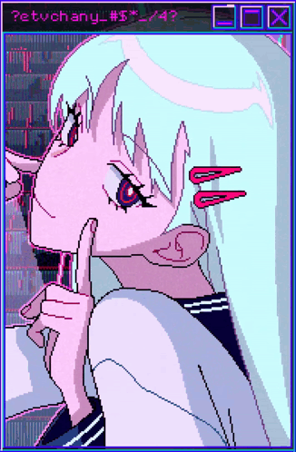

<table>
    <tr>
        <td width="70%" align="center">
            
            <pre>
💼 hse cs is'26 • back-end dev • junior
💻 с++ • python • git • sql • linux
📖 software architecture • distributed systems
🎮 music • games • anime • code • art
            </pre>
            

        </td>
        <td width="30%">
            
        </td>
    </tr>
</table>
